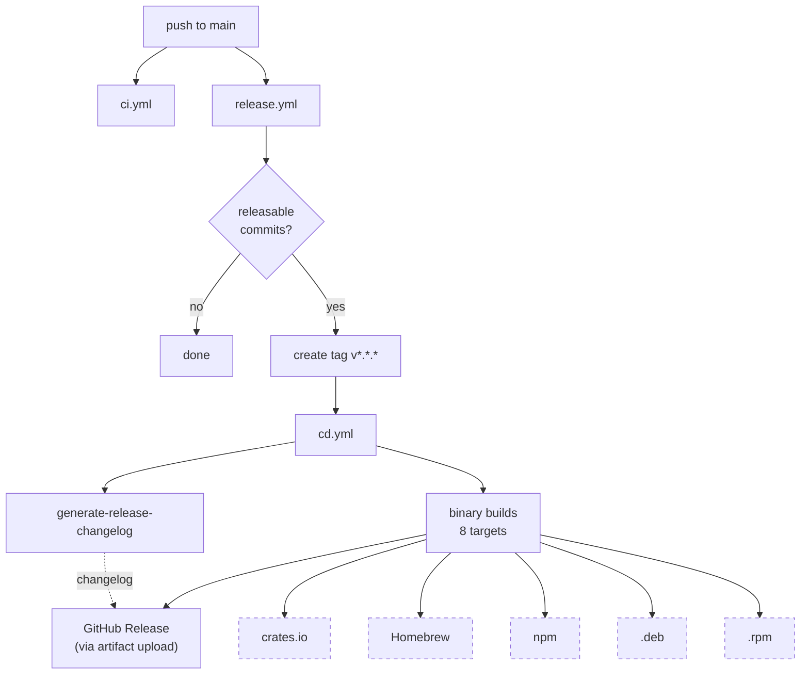
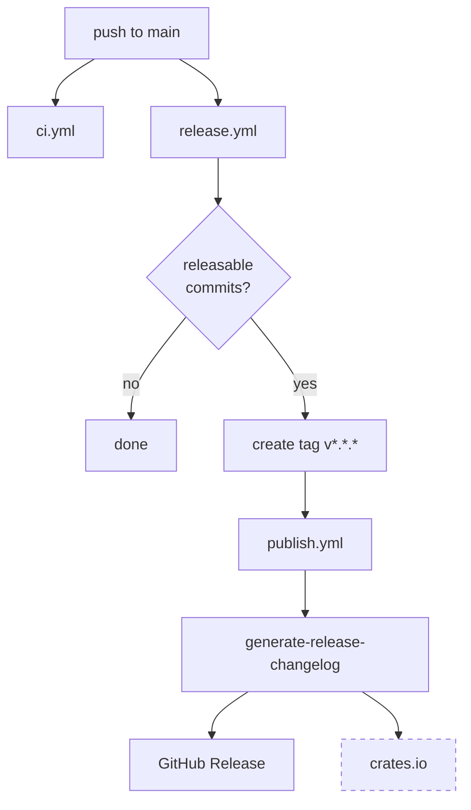

# CI/CD Pipeline

This doc maps the GitHub Actions workflows and composite actions the template generates,
and explains which path a project follows based on its feature flags.

## Workflows

| Workflow | Gate | Trigger | What it does |
|----------|------|---------|--------------|
| `ci.yml` | `has_github` | PR, push to main | fmt, clippy, nextest, doctests, cargo-deny, MSRV check |
| `lint-pr.yml` | `has_github` | PR title change | Validates conventional commit format |
| `dependabot-issues.yml` | `has_github` | Dependabot PR | Creates tracking issues for dependency updates |
| `release.yml` | `has_releases` | Push to main | Detects releasable commits via git-cliff, creates version tags |
| `cd.yml` | `has_binary_dist` | Tag `v*.*.*` | Cross-platform binary builds, GitHub Release, optional publishing |
| `publish.yml` | `has_releases and not has_binary_dist` | Tag `v*.*.*` | GitHub Release, optional crates.io publish |
| `deploy-site.yml` | `has_site` | Push to main | Build and deploy documentation site |
| `benchmarks.yml` | `has_benchmarks` | Manual, schedule | Run divan + hyperfine benchmarks |
| `roadmap.yml` | `has_roadmap_votes` | Issue vote threshold | Roadmap voting automation |

`has_binary_dist` is computed: `has_cli and has_releases`. This means:
- **CLI presets** (minimal, standard, full) with `has_releases=true` get `cd.yml`
- **Library preset** with `has_releases=true` gets `publish.yml`
- Never both in the same project

## Composite Actions

Reusable action fragments in `.github/actions/`, shared across workflows.

| Action | Gate | Used by | Purpose |
|--------|------|---------|---------|
| `setup-cargo-tools` | `has_github` | ci, cd, benchmarks, generate-release-changelog | Install and cache cargo tools via binstall |
| `setup-rust-cache` | `has_github` | ci, cd | Cargo build cache with target-specific keys |
| `bot-setup` | `has_github` | release | Configure git bot identity for automated commits |
| `generate-release-changelog` | `has_releases` | cd or publish | Extract version from tag + generate changelog via git-cliff |
| `setup-site-deps` | `has_site` | deploy-site | Install site dependencies |

## Release Pipeline

Two paths, determined by `has_binary_dist`:

### CLI projects (`has_binary_dist=true`)

Dashed boxes are opt-in via repo variables (`CRATES_IO_ENABLED`, `HOMEBREW_ENABLED`, etc.).
crates.io publish waits for binary builds to succeed.

### Library projects (`has_releases=true`, `has_binary_dist=false`)

crates.io publish runs in parallel with GitHub Release creation — no binary gate.

## git-cliff Installation

All workflows use binstall (via `setup-cargo-tools`) for git-cliff installation.
The `generate-release-changelog` composite action handles this internally.
`release.yml` also installs git-cliff directly for its `--bumped-version` check.
